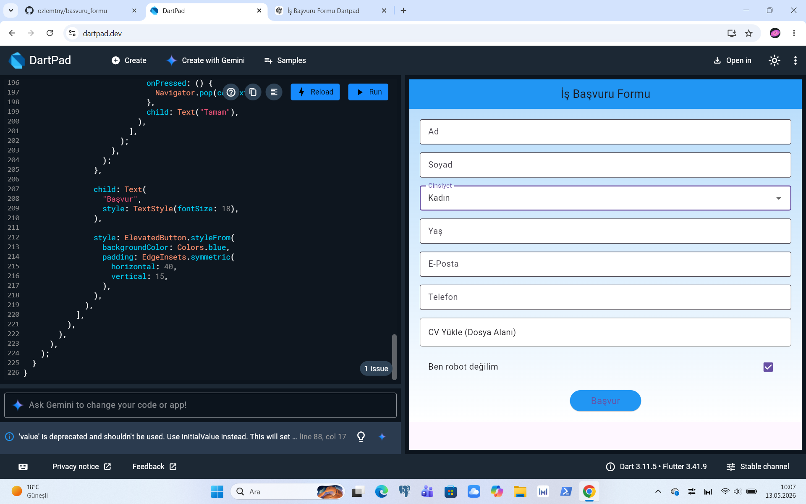

# İş Başvuru Formu Flutter Uygulaması

Bu proje, Flutter kullanılarak DartPad üzerinde hazırlanmış basit bir iş başvuru formu uygulamasıdır.

## Özellikler

- Ad alanı
- Soyad alanı
- Cinsiyet seçimi
- Yaş bilgisi
- E-posta alanı
- Telefon numarası alanı
- CV yükleme alanı
- "Ben robot değilim" seçeneği
- Başvuru gönderme butonu
- Şık ve sade arkaplan tasarımı

---

## Ekran Görüntüsü



---

## Kullanılan Teknolojiler

- Flutter
- Dart
- Material Design

---

## Projeyi Geliştiren

GitHub: [ozlemtny](https://github.com/ozlemtny)

---

## Çalıştırma

```bash
flutter pub get
flutter run
```

---

## Proje Görseli

Proje görselini görmek için:

`images/ekran.png`
